# Amazon Connectハンズオン 03

## LINE Botチャネルを作ろう

### 1-1. プロバイダーを作成する
LINE Developersのページにアクセスしてください。

[https://developers.line.biz/ja/](https://developers.line.biz/ja/)

［ログイン］ボタンをクリックします。

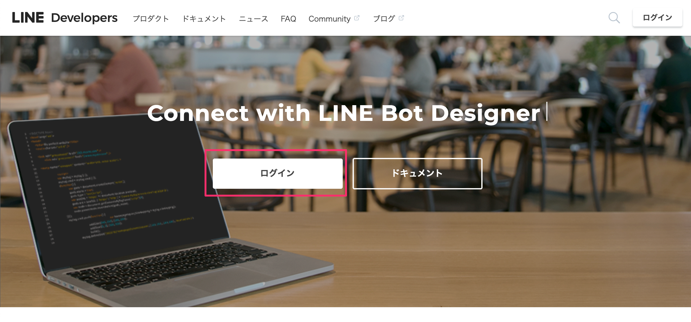

［LINEアカウントでログイン］をクリックします。

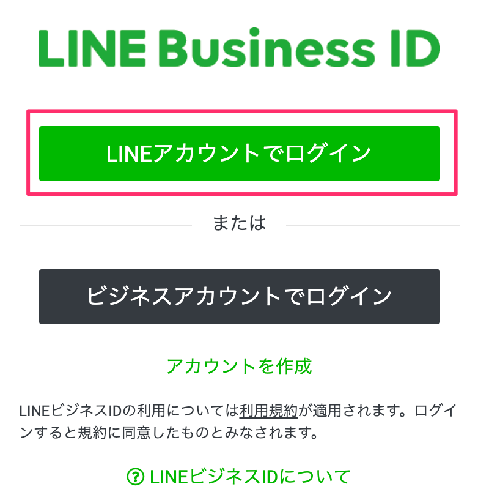

新規プロバイダーを作成します。既にプロバイダーがある方は既存のものでも問題ありません。

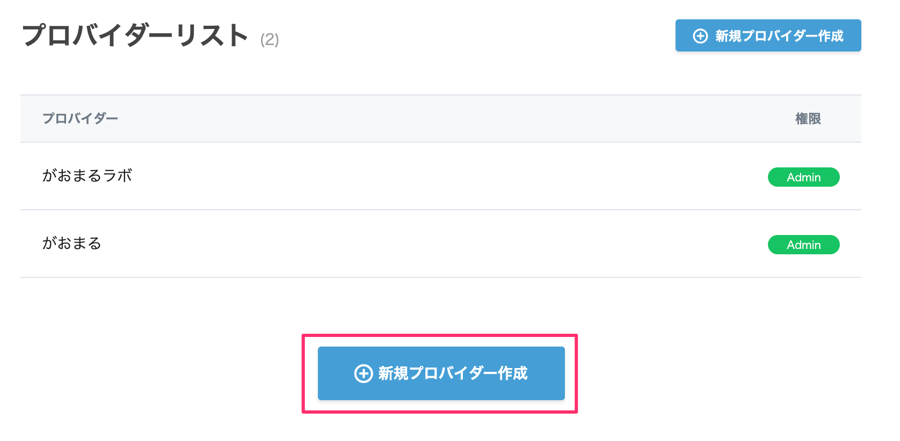

プロバイダー名を入力します。これは何でも構いません、お好きなお名前を決めてください。


［作成する］ボタンをクリックします。


### 1-2. 新規チャネルを作成する

［新規チャネル作成］をクリックします。


［Messaging API］をクリックします。


アプリのアイコンを設定します。アイコンは下記のものを利用してください。
[https://raw.githubusercontent.com/gaomar/ac-handson-03/master/icon/icon.png](https://raw.githubusercontent.com/gaomar/ac-handson-03/master/icon/icon.png)

各項目を埋めていき、［入力内容を確認する］をクリックします。

| 項目       |       値 |
|:-----------------|:------------------|
|アプリ名|Amazon Connectハンズオン|
|アプリ説明|Amazon Connectハンズオン|
|大業種|個人|
|小業種|個人（IT・コンピュータ）|
|メールアドレス|あなたのメールアドレス|


［同意する］ボタンをクリックします。


2つのチェックを入れてから、［作成］ボタンをクリックします。


作成したAmazon Connectハンズオンをクリックします。


メッセージ送受信部分にあるアクセストークンの項目の［再発行］ボタンをクリックします。


そのまま［再発行］ボタンをクリックします。


発行されたアクセストークンは後ほど使用しますので、メモしておいてください。


Bot情報部分にあるアプリのQRコードを読み取ってLINE Botと友だちになっておいてください。
その下にある、Your user IDも後ほど使用しますので、PCにメモしておいてください。


## LambdaとLINE Botを連携しよう！

### 2-1. Lambda Layerを追加する
AWSのLambdaページを開いてください。左側メニューの`Layers`をクリックして、
［レイヤーの作成］ボタンをクリックします。

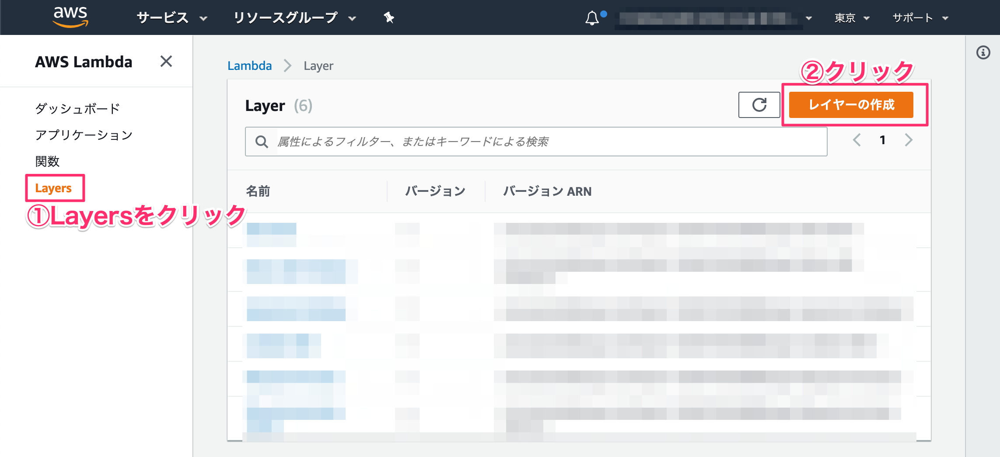

各項目を埋めていきます。linebot.zipは下記からダウンロードしてください。
[https://github.com/gaomar/ac-handson-03/raw/master/files/linebot.zip](https://github.com/gaomar/ac-handson-03/raw/master/files/linebot.zip)

［作成］ボタンをクリックします。

| 項目       |       値 |
|:-----------------|:------------------|
|名前|LINEBot-SDK|
|説明|LINEBot-SDK|
|アップロード|linebot.zip|
|ランタイム|Node.js 8.10|


### 2-2. LambdaにLINE Botを適用する
左側メニューの［関数］をクリックします。既に作成している`AmazonConnect-BMI`をクリックします。


Layersをクリックして、［レイヤーの追加］をクリックします。


先程作成したレイヤーから`LINEBot-SDK`を選択し、バージョン1を選択して、［追加］ボタンをクリックします。


追加したら`AmazonConnect-BMI`をクリックします。


下にスクロールして環境変数に`ACCESS_TOKEN`と`USER_ID`を追記します。
メモしておいたものをそれぞれ貼り付けます。

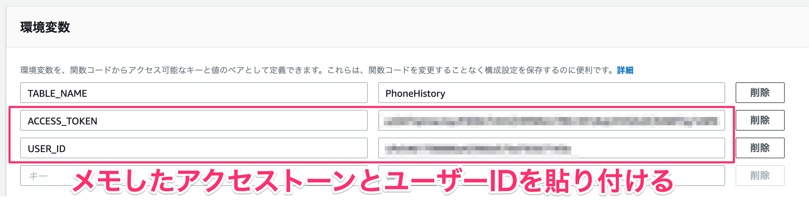

index.jsの中身を編集して、右上の［保存］ボタンをクリックします。


```javascript:index.js
const Util = require('util.js');

// LINE Botライブラリ
const line = require('@line/bot-sdk');
const client = new line.Client({
  // Lambdaの環境変数よりMessagingAPIのチャネルアクセストークンを取得
  channelAccessToken:  process.env.ACCESS_TOKEN
});

exports.handler = async (event) => {
    
    // 発信者番号
    const phoneNumber = event.Details.ContactData.CustomerEndpoint.Address;

    // 発信者番号をDynamoDBに記録
    await Util.putPhoneNo(phoneNumber);
    
    // LINE Botにも着信履歴掲載
    await client.pushMessage(process.env.USER_ID, { type: 'text', text: `${phoneNumber}から着信` });

    // 身長と体重を取得する
    const heightVal = event.Details.ContactData.Attributes.HeightVal;
    const weightVal = event.Details.ContactData.Attributes.WeightVal;
    
    // BMI計算
    const bmiVal = (parseFloat(weightVal) / (parseFloat(heightVal)/100 * parseFloat(heightVal)/100)).toFixed(1);

    // 標準体重
    const stdWeight = (22 * (parseFloat(heightVal)/100 * parseFloat(heightVal)/100)).toFixed(1);

    // LINE Botにも結果を掲載
    await client.pushMessage(process.env.USER_ID, { type: 'text', text: `BMIは${bmiVal}\n標準体重は${stdWeight}kg` });

    var speechText = `あなたのBMIは${bmiVal}です。標準体重は${stdWeight}kgです。`;

    return {"BMI": speechText};
};
```

Amazon Connectの電話にかけると、LINE Botに通知が飛んできます。


## LINE Bot用問い合わせフローを作成しよう！
### 3-1. Bot用問い合わせフローを作成する
Amazon Connectから作成したインスタンスエイリアスをクリックします。


［管理者としてログイン］ボタンをクリックします。


左側メニューにあるルーティングの［問い合わせフロー］をクリックします。


［問い合わせフローの作成］ボタンをクリックします。


フローの名前を「LINEBotフロー」を入力します。

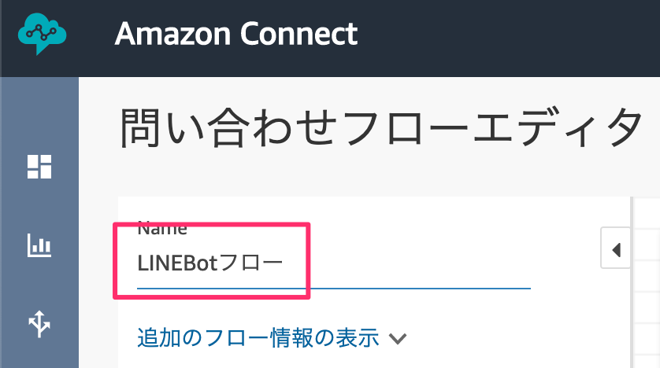

音声の設定をドラッグアンドドロップして、ブロックをクリックします。
音声の種類を決めて［Save］をクリックして、線を結びます。

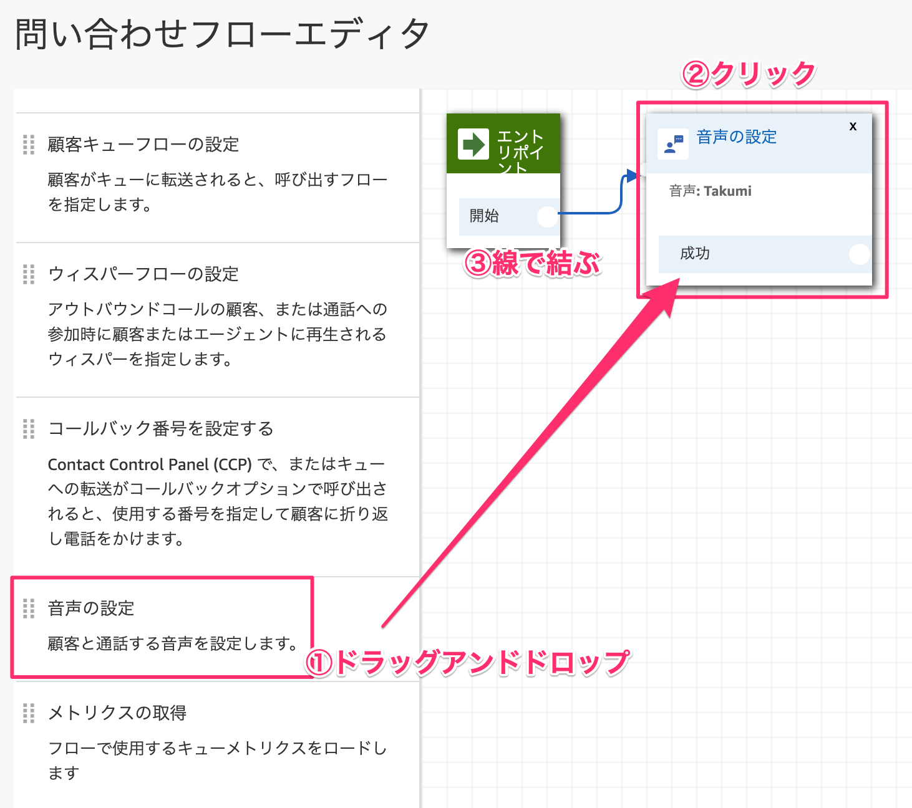

プロンプトの再生をドラッグアンドドロップして、ブロックをクリックします。

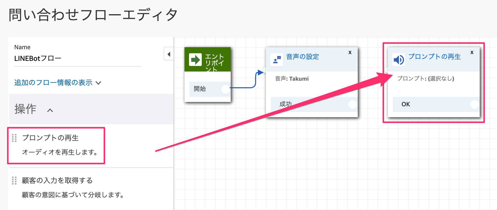

テキストの読み上げを選択して、発話内容を記述します。解釈は`SSML`を選択して、右下の［Save］ボタンをクリックします。


発話内容はこちらをコピペしてください。

```
<speak>
  <break time='2s' />
  ラインから電話依頼をされたのでかけました。それではさようなら。
</speak>
```

線で結びます。
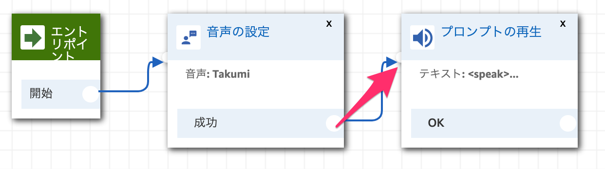

終了/ 転送カテゴリーから切断/ハングアップをドラッグアンドドロップします。

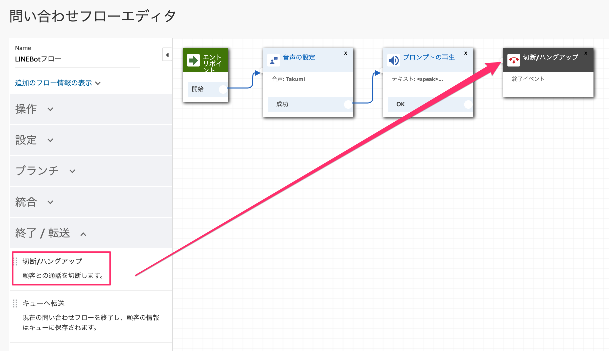

線で結びます。


［保存して発行］をクリックします。


### 3-2. IDをメモしておく
問い合わせフローの名前の下に「追加のフロー情報の表示」という項目があるので、それを展開します。展開するとARNの情報が表示されるのでinstanceのIDとconstact-flowのIDをそれぞれメモしておきます。


## Amazon ConnectとLambdaを連携しよう！
### 4-1. Lambda関数を作成する

Lambdaから新規で関数を作成します。［関数の作成］ボタンをクリックします。


関数は以下の通り入力して、［関数の作成］ボタンをクリックします。

| 項目       |       値 |
|:-----------------|:------------------|
|①関数名|AmazonConnect-LINEBot|
|②実行ロール|既存のロールを使用する|
|③既存ロール|server-role/AmazonConnect-Role|

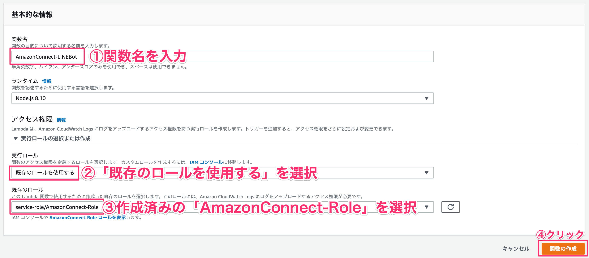

関数が作成されたら、［Layers］をクリックし、下に表示される［レイヤーの追加］ボタンをクリックします。

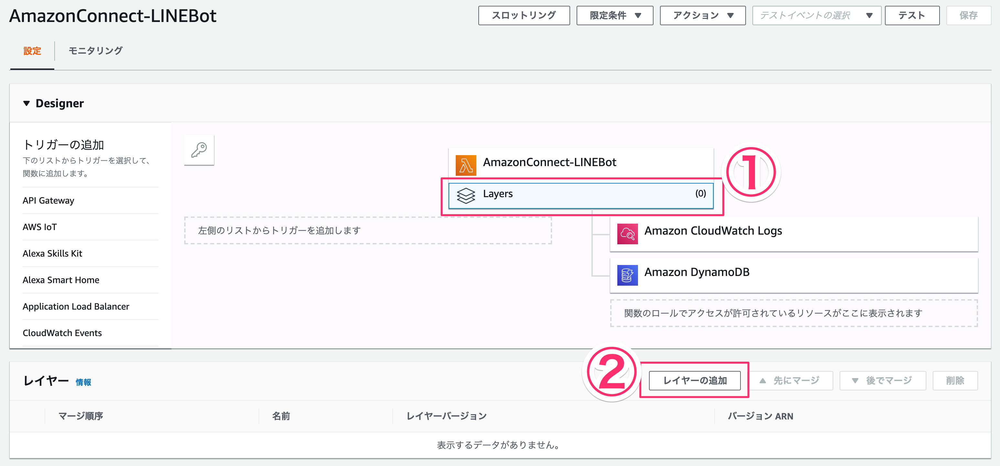

LineBot-SDKとバージョンを指定して、［追加］ボタンをクリックします。

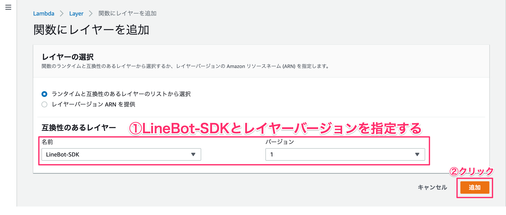

AmazonConnect-LineBot部分をクリックします。

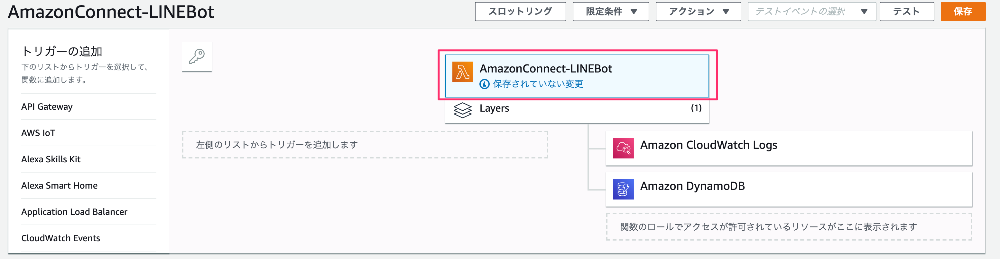

下にスクロールすると実行ロールという項目があるので、［AmazonConnect-Roleロールを表示］リンクをクリックします。

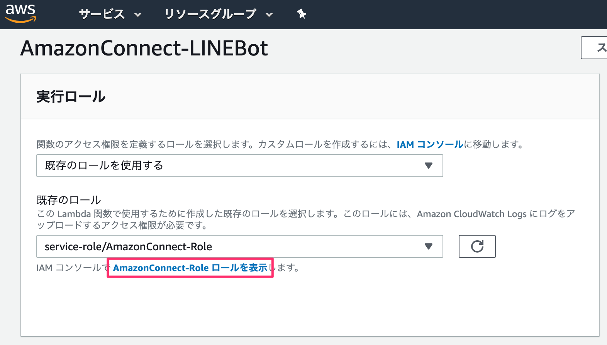

［インラインポリシーの追加］をクリックします。

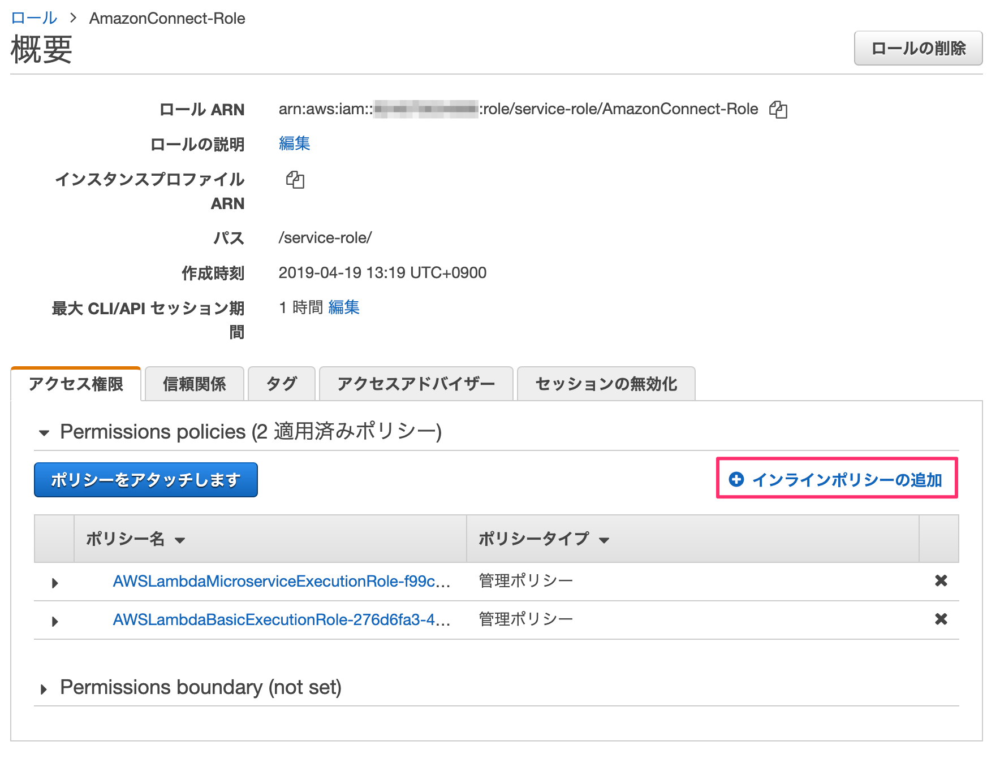

サービスを展開して、検索窓に「Connect」と入れて検索します。出てきた［Connect］をクリックします。


アクションのアクセスレベルにある「書き込み」部分を展開して、その中にある`StartOutboundVoiceContact`のチェックを入れます。


すべてのリソースを選択して、右下の［ポリシーの確認］ボタンをクリックします。


ポリシー名を入力します。`AmazonConnectPolicy`としました。右下の［ポリシーの作成］ボタンをクリックします。


Lambda画面に戻り、画面更新するとAmazon Connectの権限が追加されます。

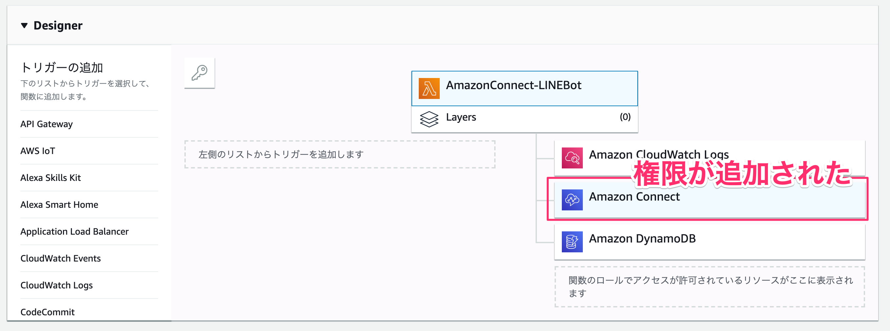

### 4-2. API Gatewayを設定する
LINE BotがLambdaを実行するためのアクセスURLを発行します。
左側メニューから`API Gateway`をクリックします。

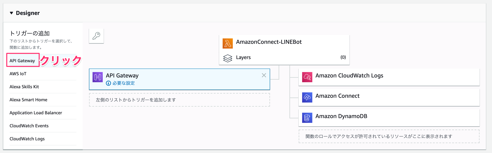

下にスクロールすると、トリガーの設定項目があるのでAPIは「新規APIの作成」を選択し、セキュリティは「オープン」にします。
設定できたら、右下の［追加］をクリックします。


右上の［保存］ボタンをクリックすると、API GatewayのアクセスURLが発行されます。

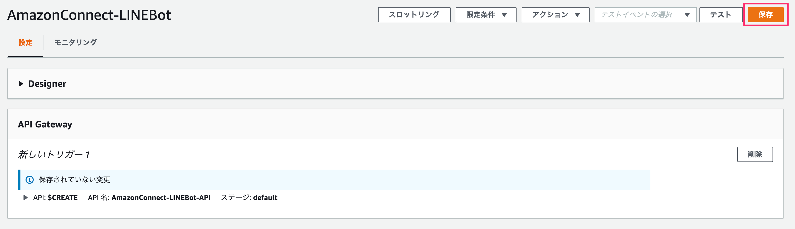

アクセスURLは後で使うので、メモしておきます。


### 4-3. Lambda関数を編集する

AmazonConnect-LineBot部分をクリックして、下に表示されるindex.jsファイルを下記コードに編集します。編集できたら［保存］ボタンをクリックします。

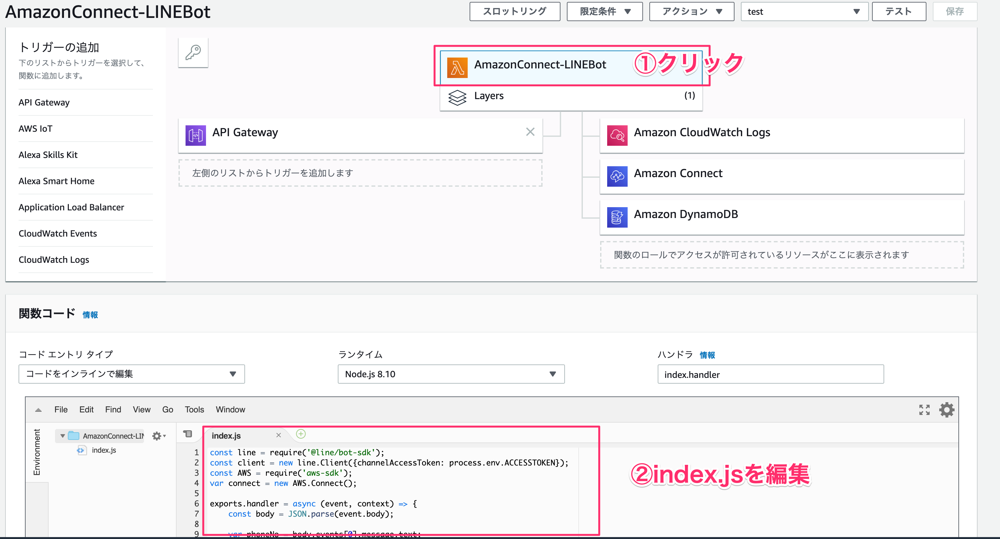

```javascript:index.js
const line = require('@line/bot-sdk');
const client = new line.Client({channelAccessToken: process.env.ACCESSTOKEN});
const AWS = require('aws-sdk');
var connect = new AWS.Connect();

exports.handler = async (event, context) => {
    const body = JSON.parse(event.body);

    var phoneNo = body.events[0].message.text;
    phoneNo = phoneNo.toLowerCase();
    // 全角→半角
    phoneNo = phoneNo.replace(/[Ａ-Ｚａ-ｚ０-９]/g, function(s) {
      return String.fromCharCode(s.charCodeAt(0) - 65248);
    });
    // スペース削除
    phoneNo = phoneNo.replace(/\s+/g, '');
    // ハイフンを小文字化
    phoneNo = phoneNo.split('－').join('-');
    // ハイフンを削除
    phoneNo = phoneNo.split('-').join('');
    // ドット削除
    phoneNo = phoneNo.split('.').join('');
    // 括弧削除
    phoneNo = phoneNo.split('(').join('');
    phoneNo = phoneNo.split(')').join('');
    phoneNo = phoneNo.split('（').join('');
    phoneNo = phoneNo.split('）').join('');
    // 先頭が0なら+81にする
    phoneNo = phoneNo.replace(/^0/, '+81');
    // 先頭が数字なら+をつける
    phoneNo = phoneNo.replace(/^[1-9]/, '+');
    
    const message = {
        'type': 'text',
        'text': `${body.events[0].message.text}に電話をするよ`
    };

    var params = {
        ContactFlowId: process.env.CONTACTFLOWID,
        DestinationPhoneNumber: phoneNo,
        InstanceId: process.env.INSTANCEID,
        SourcePhoneNumber: process.env.SOURCEPHONENUMBER
    };

    var calling = connect.startOutboundVoiceContact(params, function(err, data) {
        if (err) {
          console.log(err);
        } else {
          console.log(data);
        }
    });

    var response = await client.replyMessage(body.events[0].replyToken, message);
    const lambdaResponse = {
        statusCode: 200,
        headers: { "X-Line-Status" : "OK"},
        body: '{"result":"completed"}'
    };
    context.succeed(lambdaResponse);
   
};
```

### 4-4. 環境変数を設定する
LINE BotのアクセストークンとAmazon Connectの問い合わせフローのIDをそれぞれ設定します。

| キー名       |       値 |
|:-----------------|:------------------|
|ACCESSTOKEN|1-2で作成したLINE Botのアクセストークン|
|CONTACTFLOWID|3-2でメモした<span style="color: blue; ">contact-flow</span>のID|
|INSTANCEID|3-2でメモした<span style="color: red; ">instance</span>のID|
|SOURCEPHONENUMBER|Amazon Connectで取得した電話番号|


## LINE Botと連携しよう
### 5-1. LINE BotのWebhookを設定する
LINE BotとLambdaを連携するためにLINE BotのWebhook URLを指定します。
［編集］ボタンをクリックします。


API Gatewayで発行したアクセスURLを貼り付けます。［更新］ボタンをクリックします。

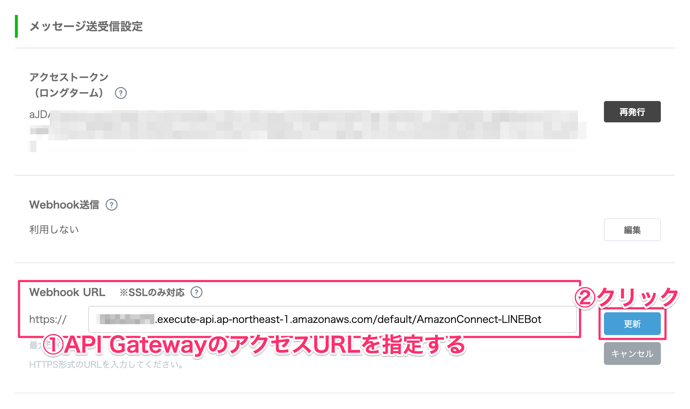

Webhook送信部分にある編集をクリックします。「利用する」を選択して［更新］ボタンをクリックします。


### 5-2. LINE Botの設定を変更する
自動応答メッセージは利用したくないので、［設定はこちら］のリンクをクリックします。


あいさつメッセージと応答メッセージをそれぞれ**オフ**にします。


これでLINE Botに電話をかけたい番号を入力するとAmazon Connectから電話がかかってきます。くれぐれも電話番号の入力ミスには気をつけてください。

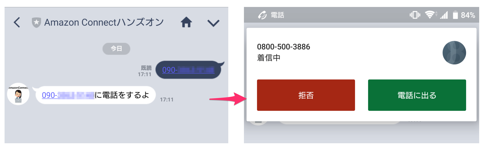
