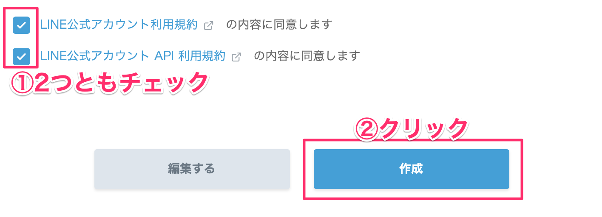
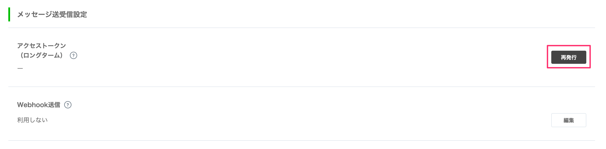

# Amazon Connectハンズオン 03

## LINE Botチャネルを作ろう

### 1-1. プロバイダーを作成する
LINE Developersのページにアクセスしてください。

[https://developers.line.biz/ja/](https://developers.line.biz/ja/)

［ログイン］ボタンをクリックします。


［LINEアカウントでログイン］をクリックします。


新規プロバイダーを作成します。既にプロバイダーがある方は既存のものでも問題ありません。


プロバイダー名を入力します。これは何でも構いません、お好きなお名前を決めてください。


［作成する］ボタンをクリックします。


### 1-2. 新規チャネルを作成する

［新規チャネル作成］をクリックします。


［Messaging API］をクリックします。


アプリのアイコンを設定します。アイコンは下記のものを利用してください。
[https://raw.githubusercontent.com/gaomar/ac-handson-03/master/icon/icon.png](https://raw.githubusercontent.com/gaomar/ac-handson-03/master/icon/icon.png)

各項目を埋めていき、［入力内容を確認する］をクリックします。

| 項目       |       値 |
|:-----------------|:------------------|
|アプリ名|Amazon Connectハンズオン|
|アプリ説明|Amazon Connectハンズオン|
|大業種|個人|
|小業種|個人（IT・コンピュータ）|
|メールアドレス|あなたのメールアドレス|


［同意する］ボタンをクリックします。


2つのチェックを入れてから、［作成］ボタンをクリックします。



作成したAmazon Connectハンズオンをクリックします。


メッセージ送受信部分にあるアクセストークンの項目の［再発行］ボタンをクリックします。



そのまま［再発行］ボタンをクリックします。


発行されたアクセストークンは後ほど使用しますので、メモしておいてください。


Bot情報部分にあるアプリのQRコードを読み取ってLINE Botと友だちになっておいてください。
その下にある、Your user IDも後ほど使用しますので、PCにメモしておいてください。


## LambdaとLINE Botを連携しよう！

### 2-1. Lambda Layerを追加する
AWSのLambdaページを開いてください。左側メニューの`Layers`をクリックして、
［レイヤーの作成］ボタンをクリックします。


各項目を埋めていきます。linebot.zipは下記からダウンロードしてください。
[https://github.com/gaomar/ac-handson-03/raw/master/files/linebot.zip](https://github.com/gaomar/ac-handson-03/raw/master/files/linebot.zip)

［作成］ボタンをクリックします。

| 項目       |       値 |
|:-----------------|:------------------|
|名前|LINEBot-SDK|
|説明|LINEBot-SDK|
|アップロード|linebot.zip|
|ランタイム|Node.js 8.10|


### 2-2. LambdaにLINE Botを適用する
左側メニューの［関数］をクリックします。既に作成している`AmazonConnect-BMI`をクリックします。


Layersをクリックして、［レイヤーの追加］をクリックします。


先程作成したレイヤーから`LINEBot-SDK`を選択し、バージョン1を選択して、［追加］ボタンをクリックします。


追加したら`AmazonConnect-BMI`をクリックします。


下にスクロールして環境変数に`ACCESS_TOKEN`と`USER_ID`を追記します。
メモしておいたものをそれぞれ貼り付けます。


index.jsの中身を編集して、右上の［保存］ボタンをクリックします。


```javascript:index.js
const Util = require('util.js');

// LINE Botライブラリ
const line = require('@line/bot-sdk');
const client = new line.Client({
  // Lambdaの環境変数よりMessagingAPIのチャネルアクセストークンを取得
  channelAccessToken:  process.env.ACCESS_TOKEN
});

exports.handler = async (event) => {
    
    // 発信者番号
    const phoneNumber = event.Details.ContactData.CustomerEndpoint.Address;

    // 発信者番号をDynamoDBに記録
    await Util.putPhoneNo(phoneNumber);
    
    // LINE Botにも着信履歴掲載
    await client.pushMessage(process.env.USER_ID, { type: 'text', text: `${phoneNumber}から着信` });

    // 身長と体重を取得する
    const heightVal = event.Details.ContactData.Attributes.HeightVal;
    const weightVal = event.Details.ContactData.Attributes.WeightVal;
    
    // BMI計算
    const bmiVal = (parseFloat(weightVal) / (parseFloat(heightVal)/100 * parseFloat(heightVal)/100)).toFixed(1);

    // 標準体重
    const stdWeight = (22 * (parseFloat(heightVal)/100 * parseFloat(heightVal)/100)).toFixed(1);

    // LINE Botにも結果を掲載
    await client.pushMessage(process.env.USER_ID, { type: 'text', text: `BMIは${bmiVal}\n標準体重は${stdWeight}kg` });

    var speechText = `あなたのBMIは${bmiVal}です。標準体重は${stdWeight}kgです。`;

    return {"BMI": speechText};
};
```

Amazon Connectの電話にかけると、LINE Botに通知が飛んできます。


